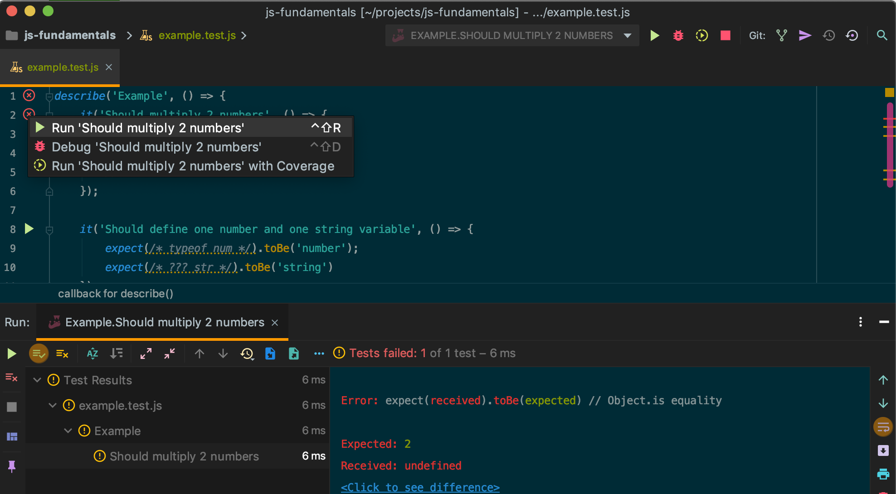
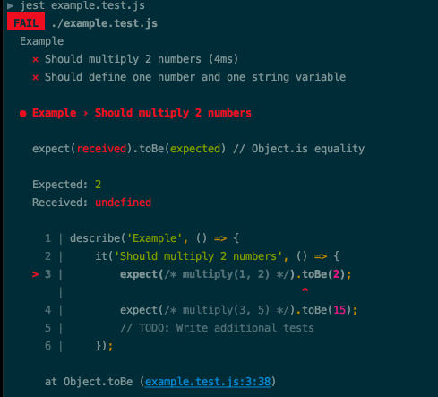
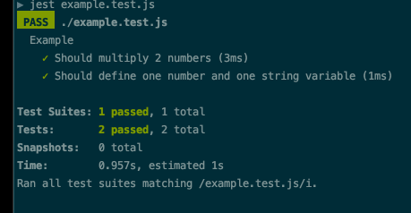

## Требования

Все задания должны быть выполнены отдельным юнит тестом на основе заготовки [Unit testing](https://en.wikipedia.org/wiki/Unit_testing).
Для тестирования мы будем использовать framework [Jest](https://jestjs.io/)
Для знакомства с Jest прочитайте 2 раздела документации [Getting started](https://jestjs.io/docs/en/getting-started) и [Using matchers](https://jestjs.io/docs/en/using-matchers)

## Начало работы

- Установить nodejs, предпочтительнее установить LTS версию https://nodejs.org/en/ Если у вас установлена node.js - пропустите этот шаг
- Форкнуть данный проект https://help.github.com/en/articles/fork-a-repo
- После того, как вы форкнули проект, он будет добавлен к вам на github-e. Склонируйте проект из своего профиля
- Откройте консоль(терминал, cmd)
- Перейдите в дирикторию проекта
- Выполните команду `npm install`

## Как запустить тесты

Выполните в консоли команду `npm run test#.#` где #.#  подгруппы задания
Пример: для 1.1 Базовые типы данных следует выполнить `npm run test1.1`

Для того, чтобы выполнить только конкретный тест из файла, можно после it добавить "only"
Пример:

```js
describe("Test group", () => {
  it("Test1", () => {
    expect(true).toBe(true);
  });

  // Only run this test
  it.only("Test2", () => {
    expect(true).toBe(true);
  });

  it("Test3", () => {
    expect(true).toBe(true);
  });
});
```

Также можно использовать встроенные средства для работы с тестами в вашем редакторе. Для vs code подойдет плагин jest runner
 

## Как выполнять задания

Для каждого задания указан файл шаблона, в котором вам следует писать код.
Каждый файл включает группу заданий (блок describe), Каждое задание это один тест (блок it)

Пример: файл шаблона `example.test.js` содержит одну группу заданий `Example` с 2-мя заданиями

```Js
    describe('Example', () => {
        it('Should multiply 2 numbers', () => {
           expect(/* multiply(1, 2) */).toBe(2);
           expect(/* multiply(3, 5) */).toBe(15);
            // TODO: Write additional tests
        });

        it('Should define one number and one string variable', () => {
            expect(/* typeof num */).toBe('number');
            expect(/* ??? str */).toBe('string')
        });
    });
```

Чтобы запустить тесты следует выполнить команду jest example.test.js.
Результатом будет два непройденых теста



Вносим следующие правки:

```js
describe("Example", () => {
  it("Should multiply 2 numbers", () => {
    function multiply(a, b) {
      return a * b;
    }

    expect(multiply(1, 2)).toBe(2);
    expect(multiply(3, 5)).toBe(15);
    expect(multiply(-3, 5)).toBe(-15);
    expect(multiply(0, 5)).toBe(0);
  });

  it("Should define one number and one string variable", () => {
    const num = 10;
    const str = "hello";

    expect(typeof num).toBe("number");
    expect(typeof str).toBe("string");
  });
});
```

Запускаем тесты повторно и получаем результат - все тесты пройдены



# Справочные ресурсы

- [MDN](https://developer.mozilla.org/docs/Web/JavaScript/Reference)
- [DevDocs](http://devdocs.io/javascript)
- [JavaScript.info](http://javascript.info)

# Как синхронизироваться с основным репозиторием
- [Configuring a remote for a fork](https://help.github.com/en/articles/configuring-a-remote-for-a-fork)
- [Syncing a fork](https://help.github.com/en/articles/syncing-a-fork)

# Задания

## 1 Операторы и типы данных

### 1.1 Базовые типы данных

В качестве шаблона и уточнения заданий использовать файл `datatypes.test.js`

Запуск теста `npm run test1.1`

- Объявить 2 переменных a и b типа boolean с разными значениями. Убедиться, что тип переменных boolean

- Написать 4 выражения с двумя булевскими операндами, используя следующие операторы: логическое И, логическое ИЛИ, логическое НЕ и двойное логическое НЕ

- Написать 4 выражения с минимум 3-мя операндами, используя следующие операторы: логическое И, логическое ИЛИ, логическое НЕ и двойное логическое НЕ. В части выражений использовать группировки

- Задать минимум 5 числовых переменных со следующими значениями: целое, дробное, NaN, бесконечность,
  близкое к максимально безопасному целому. В качестве значения можно использовать выражения

- Написать несколько выражений с 2 операндами и базовыми операторами: сложение, вычитание, умножение и деление

- Написать несколько выражений с 3-мя и более операндами и базовыми операторами: сложение, вычитание, умножение и деление

- Написать минимум пять конвертаций различных строк в число. Примеры: целое, дробное, бесконечность, число в двоичной системе исчисления, строка текста

- Задать строку 5-ю различными способами: используя одинарные кавычки, двойные кавычки, шаблонные строки “`”, глобальный объект String без и с new

- Объявить три переменные со значениями null и undefined и без значения. Определить их типы

- Объявить 2 переменные типа Symbol c одинаковыми описанием

### 1.2 Функции

В качестве шаблона использовать `function-basic.test.js`
Запуск теста `npm run test1.2`

- Создать функцию, используя Объявление функции (Function Declaration)

- Создать функцию, используя Функциональное выражение (Function expression)

- Создать функцию суммы, принимающую 2 аргумента

- Создать функции с одним, двумя, тремя и без аргументов, возвращающие количество переданных при вызове аргументов

- Создать функцию без аргументов, которая возвращают аргумент в n-й позиции. В качестве n-й позиции использовать первый аргумент функции

- Создать функцию, которая возвращает строку, в которой каждый аргумент с двух сторон обрамлен “|”

- Создать функцию, принимающую другую функцию и возвращающую результат вызова переданной функции с префиксом “Result is ”

### 1.3 Number

В качестве шаблона использовать number.test.js
Запуск теста `npm run test1.3`

- Написать несколько выражений нахождения остатка от деления
- Написать функцию нахождения среднего от трех аргументов
- Написать функцию нахождения последней цифры в числе
- Написать функцию нахождения суммы цифр в числе
- Написать функцию определения является ли число простым
- Написать функцию конвертации строки в число
- Написать функцию нахождения максимального числа с использованием [Math](https://developer.mozilla.org/en-US/docs/Web/JavaScript/Reference/Global_Objects/Math) и без
- Написать функцию нахождения минимального числа с использованием Math и без
- Написать несколько примеров округления к ближайшему целому с использованием Math и без
- Написать несколько примеров округления к наименьшему целому с использованием Math и без
- Конвертировать бинарную запись числа в десятичное представление
- Конвертировать восьмибитное представление числа в десятичное

### 1.4 String

В качестве шаблона использовать string.test.js
Запуск теста `npm run test1.4`

- Написать функцию объединения двух строк через пробел. Решить задачу минимум двумя способами
- Найти длину строки
- Создать функцию, возвращающую сообщение приветствия. В качестве аргумента функция должна принимать имя
- Удалить пробельные символы с начала и с конца строки
- Заменить все вхождения слова в строку на заданное
- Написать функцию валидации длинны строки
- Написать функцию сравнения строк без учета регистра
- Обрезать строку по заданному лимиту

## 2 Работа с контекстом

### 2.1 Замыкание

В качестве шаблона использовать function-n-closure.test.js

- Создать композицию из 2-х заданных функций
- Создать пользователя с уникальным идентификатором. Каждый новый идентификатор должен отличаться на 1 от предыдущего
- Функция при каждом вызове должна возвращать новое значение, увеличенное на заданный шаг, начиная с указанного значения
- Создание функции внутри цикла. Исправить код так, чтобы были пройдены тесты
- Найти несколько способов исправления кода
- Реализация приватного доступа
- Функция должна создавать функцию умножения на заданный аргумент
- Подсчитать количество вызовов заданной функции
- Создать функции мемоизации от одного аргумента. Функция должна кешировать результат вычисления от одного аргумента
- Логировать начало выполнения функции и завершение выполнения функции
- Функция должна оборачивать другую функцию. Результат должен вычисляться только при первом вызове функции. При последующих вызовах должен возвращаться результат первого вызова без перерасчетов
- Каринг. Создать функцию, которая принимает другую функцию F от двух аргументов и возвращает функцию от одного аргумента. Создать еще одну функцию, которая при вызове возвращает фунцию от одного аргумента и при вызове возвращает результат выполнения функции F от двух аргументов

### 2.2 Изменение и привязка контекста

В качестве шаблона использовать this.test.js

- Вызвать функцию, дублирующую сообщение из this.msg. В качестве контекста использовать различные объекты
- Из исходной функции создать новую с привязкой нового контекста
- Использование метода объекта в качестве значения переменной с вызовом с правильным контекстом

### 2.3 Наследование

В качестве шаблона использовать   prototype.test.js

- Функция-конструктор для создания пользователя с именем и сообщением приветствия
- Функция-конструктор для создания пользователя с именем и сообщением приветствия через прототип
- Создать ArticleList c двумя методами добавления статьи и получения количества статей с использованием прототипа
- Создать класс Component c 3-мя методами setData(obj), getData() и render(). setData() должен сливать (merge) существующие данные с переданными.
  Пример: если текущие данные {name: 'Bob', msg: 'Hello'} то setData({name: 'Tom') то в this.data должно быть {name: 'Tom', msg: 'Hello'}
  Метод getData() возвращает текущие данные. Метод render() должен вернуть пустую строку Унаследовать от Component UserComponent
  Переопределить метод render так, чтобы он возвращал строку `${msg}, ${name}!`, используя `this.data`. Eсли name null или undefined - вместо имени использовать guest.
  Добавить два метода login и logout. Метод login в качестве имени устанавливает переданное значение. Logout вместо имени устанавливает null
- Создать функцию extend(Child, Parent) для классового наследования Протестировать на классах Component и UserComponent из предыдущего задания
- Создать классы Component и UserComponent, используя class declaration
- Создать объект, используя в качестве прототипа другой объект через Object.create

## 3 Структуры данных

### 3.1 Object

В качестве шаблона использовать object.test.js

- Найти значения в объекте по заданному пути
- Создать новый объект из указанных свойств из заданного объекта
- Клонирование объекта. Решить задачу несколькими способами
- Поверхностное сравнение двух объектов
- Глубокое сравнение двух объектов
- Исправить функцию проверки доступа

### 3.2 Array

В качестве шаблона использовать array.test.js

- Найти позицию первого вхождения заданного элемента в массив
- Создать массив, два раза повторяющий исходный массив
- Конвертировать массив чисел в массив строк. Усложненный вариант - конвертировать массив из значений любых типов в массив строк
- Найти количество вхождений заданного элемента в массив
- Конвертировать массив строк в массив строк в верхнем регистре
- Вставить элемент в заданную позицию массива
- Найти последние n-элементов в массиве
- Найти 3 самых больших элемента в массиве
- Отсортировать массив чисел, используя метод Array. Дополнительно написать [сортировку пузырьком](https://en.wikipedia.org/wiki/Bubble_sort)
- Найти сумму всех элементов массива чисел
- Найти все уникальные элементы массива. Решить 2-мя способами. В одном из решений использовать Set
- Сгруппировать массив объектов по заданному ключу
- Удалить из массива все ложные значения
- Сделать массив массивов плоским с глубиной в один уровень
- Сделать массив массивов плоским рекурсивно
- Найти пересечения двух массивов
- Удалить из массива все элементы, не удовлетворяющие заданному условию
- Создать стек на основе массива
- Создать очередь на основе массива
